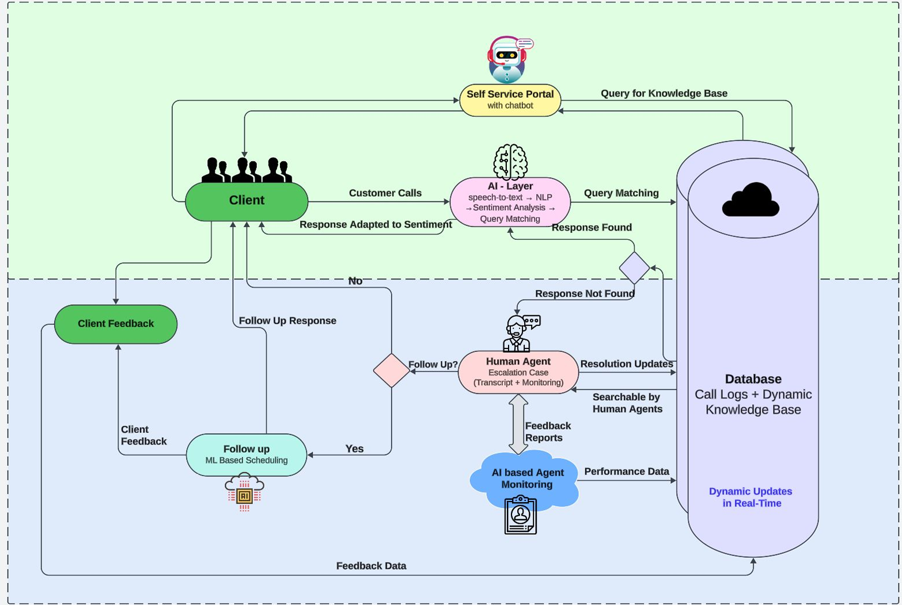

# TaskPilot - Smart agent workflow manager

## AI-Powered Workflow & Efficiency Enhancement for BPOs

This repository contains the codebase for our AI-driven claims processing automation system, designed to streamline operations in Business Process Outsourcing (BPO) companies. The solution leverages cutting-edge technologies to improve client experience, enhance workflow efficiency, and reduce the workload on human agents.

---

## **How to Run the Project**

1. **Clone the repository:**
   ```bash
   git clone https://github.com/NidhiIyer04/TaskPilot.git
   cd TaskPilot
   ```

2. **Install dependencies:**
   ```bash
   npm install
   ```
3. **set up environment variables**
   ```bash
   touch .env
   ```

Here’s a **well-formatted section** to add to your **README.md** file with proper Markdown syntax and professional presentation for the **environment variables setup**.

---

## 🔧 **Environment Variables Setup**

To run this project, make sure to set up the following environment variables in a **`.env`** file in the **root directory** of your project.

### 📋 **Required Environment Variables:**

| **Variable Name**       | **Description**                                       | **How to Get It**                                                       |
|-------------------------|-------------------------------------------------------|--------------------------------------------------------------------------|
| `PORT`                  | The port on which your server will run (e.g., `5000`). | You can set it to any available port number, e.g., `5000` or `8080`.      |
| `MONGO_URI`             | MongoDB connection string.                            | Get it from your **MongoDB Atlas** account or your local MongoDB setup.  |
| `GROQ_API_KEY`          | API key for **Groq Speech-to-Text API**.              | Sign up at **[Groq Console](https://console.groq.com/keys)** to get the key. |
| `PLAYHT_USER_ID`        | User ID for **Play.ht API** (Text-to-Speech service). | Access it from **[Play.ht Studio](https://play.ht/studio/api-access)**.  |
| `PLAYHT_API_KEY`        | API key for **Play.ht API**.                          | Access it from **[Play.ht Studio](https://play.ht/studio/api-access)**.  |
| `GEMINI_API_KEY`        | API key for **Google Gemini AI API**.                 | Get it from **[Google AI Studio](https://aistudio.google.com/apikey)**.  |
| `GEMINI_MODEL_ID`       | The **fine-tuned model ID** for Gemini AI.            | Run the provided Python script **`fine_tune.py`** to get your **model ID**. |

---


4. **Start the backend server:**
   ```bash
   cd backend
   node server.js
   ```

5. **Run the frontend for report generation:**
   ```bash
   cd frontend
   npm start
   ```

   
---

## **Project Overview**

This AI-powered system automates routine tasks, prioritizes follow-up calls, performs real-time sentiment analysis during client interactions, and provides a dynamic knowledge base for agents. It also offers a self-service client portal to reduce the need for direct agent intervention.

### **Key Features:**
1. **AI-Driven Query Handling**  
   - Multilingual support to handle client queries using an AI system that interacts with a dynamic knowledge base.

2. **Real-Time Sentiment Analysis**  
   - The system analyzes client sentiment to tailor interactions accordingly.

3. **Automated Scheduling**  
   - Follow-up calls are scheduled automatically based on urgency and sentiment analysis.

4. **Dynamic Knowledge Base**  
   - Agents can access encrypted call logs and resources for faster resolutions.

5. **Streamlined Agent Portal**  
   - A unified interface that integrates call logs, insights, knowledge base, and schedules.

6. **Client Self-Service Portal**  
   - A chatbot-enabled portal available 24/7 for clients to resolve queries and track claims.

---

## **Tech Stack**

- **Frontend:** React.js  
- **Backend:** Node.js with Express.js  
- **Database:** MongoDB (cloud-hosted)  
- **Speech-to-Text:** TensorFlow / PyTorch  
- **Sentiment Analysis:** NLP Models  
- **Chatbot:** OpenAI GPT (integrated via LangChain)  
- **Authentication:** bcrypt.js and validator.js  
- **Hosting:** Vercel (Frontend) + AWS Lambda (Backend)  
- **Real-Time Communication:** Socket.io + Redis  
- **Scheduling Models:** XGBoost, LightGBM, Scikit-Learn  

---

## **Features in Action**

### **1. AI Query Handling Flow:**
- Client interacts with the AI chatbot.
- The system checks the knowledge base for relevant solutions.
- If unresolved, it escalates to a human agent.

### **2. Sentiment Analysis:**
- The AI analyzes the client's tone during the call to understand emotions.
- Responses are tailored based on detected sentiments (e.g., frustration, satisfaction).

### **3. Automated Scheduling:**
- Calls are prioritized based on urgency and sentiment scores.

---

## **Flowchart**





## **Contributors**

- **Krishna Priya Karumuri** – DevOps and Cloud  
- **Nagasri Karumuri** – Frontend Developer  
- **Nidhi Iyer** – AI, Machine Learning, and MLOps  
- **Khyati Satija** – Backend Developer  
- **Nihitha Bolisetty** – Frontend Developer and UI/UX  

---

